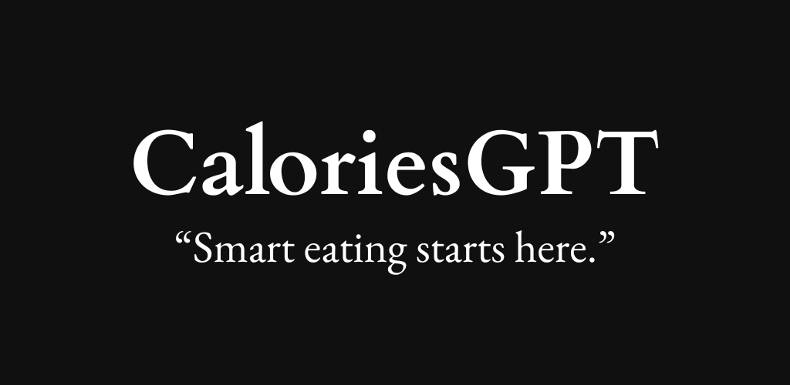

# CaloriesGPT


## About
An android app that helps users log their meals and track calories.  
Free users can access basic analytics and up to 3 logs.  
Subscribers get unlimited logs and premium insights.

---

## Features
- **Meal Analytics** – Track calories and view breakdowns.
- **Log Meals** – Add your meals with calorie counts.
- **Analytics** – A Github style heatmap to view daily calorie intake.
- **Free Plan** – Limited to 3 logs with analytics access.
- **Pro Plan** – Unlimited logs and personalized insights.

---

## Tech Stack
- React Native for frontend
- NodeJS for backend

---

## Getting Started

### Installation
```bash
# Clone the repo
git clone https://github.com/your-username/caloriesgpt.git

# Install dependencies
cd caloriesgpt
npm install
# or
yarn install
```

### Running the App
```bash
# For iOS
npx react-native run-ios

# For Android
npx react-native run-android
```

### AI Usage
Small AI use, just used for getting ideas or solving a problem mainly, and generating this readme.md file. I would put a total of 12 percent AI use.